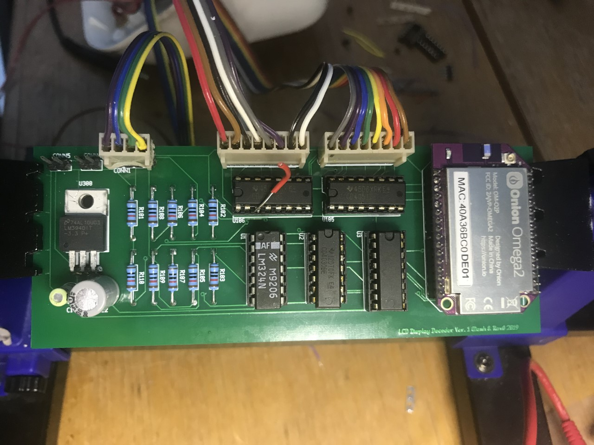
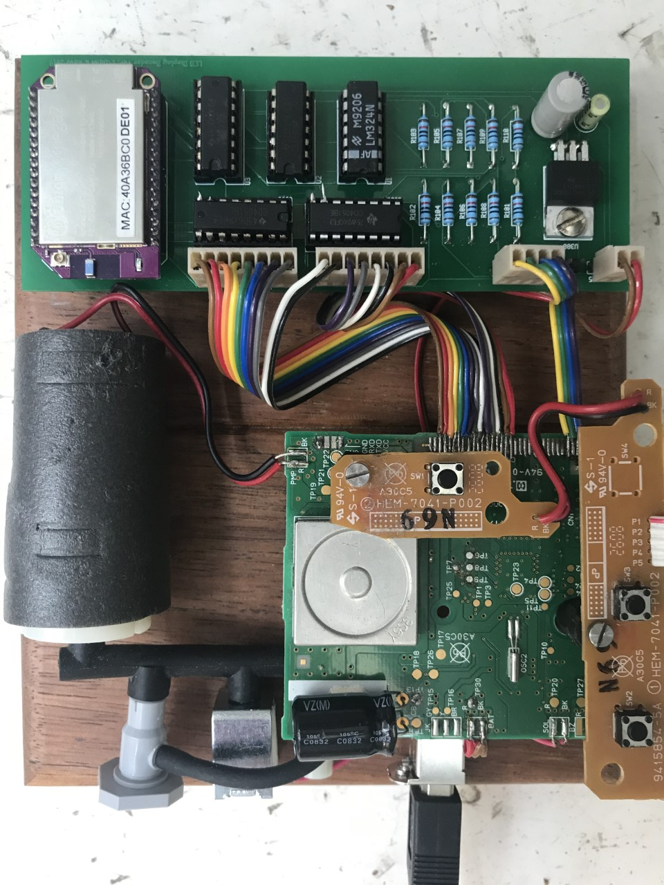

# BloodPressure
Reverse engineering a Blood Pressure Monitor

Several years passed (6?) since I embarked on this
### Phase 1
    First attemp was to quickly read the eeprom chip on board with the help of Dan who isolated
    the chip from the bus    Used parallel port of pc to read the eeprom .Found that it only 
    contained bootup code instead of bp reading. It has just enough words that corresponded 
    with number of BP readings that device stored. Tried several means of  compacting all the 
    readings into eeprom but it did not quite workout. More over, the contents of eeprom did not 
    change as more readings are added or deleted. Spent lot of time chasing Toshiba microprocessor
    details, and finally got some data based on chip whose marking are similar. To our dismay 
    the IC contained internal EEPROM !!!. So we can't directly access it.

### Phase 2
    Thought of tracking display driver data lines.Realizing all of the display driver is embedded 
    in the main processor, the only recourse was to tap into the lcd drive signals coming from the 
    microprocessor.As we were preparing to do this, my dear friend Dan inadvertantly ripped the cable
    off the lcd panel. That made things doubly hard. Now the saga to re attach the cable with
    ztape (u bute technology) started. Despite Dan's skill in dealing with things that require dexterity
    we could not align the ribbon cable back on the the pcb pad with tracks spaced at 1mm. 

### Phase 3
    Had to understand how LCD panel are driven. Dan once again with his superior analytical skills
    and patience, managed to see which signal lines excited each of the display segments and symbols
    on the LCD panel. Given the LCD segment control signals and the associated drive signals are 
    analogue after considerable research into how these work in tandem, devised a simple electronic
    circuit, to sum and condition the control and drive signals to get a digital signal that enables
    us to figure out the digits being displayed. Identified a wonderful coin sized onion device that
    has wifi, 16 digital i/o with linux OS for 20dollars. The idea is to use this to drive the digital
    circuit to enable selection of segment to read and decode the digits that are being displayed
    Note we have no way of visually verifying the displayed data.
### Phase 4
    After long pause due to my deployment, resumed consilidation of the conceived
signal conditioner was evaluated on bread board. It worked as expected and
we were able to decode the LCD line signals and read systolic, diastolic pressures
along with heart rate. Tried to make a pcb with CNC router but that caused
angst at no length due to bridged tracks. Reverted back to PCB to see if there
had been a mistake. In  the end decided to ditch the CNC route, and got a
proper PCB made. Found that JLCPcb.com was found to be the best choice in terms
of price and quality. A two layer pcb of decent size costed me just around 
ten dollars.

Here is the setup while testing the pcb circuit interfaced with bp meter lcd signal bus.

### Phase 5
Dan had an idea of gutting the bp meter internals from its original case and laying out
bare on a nice piece of wood as a display rather than encasing everything in the original
case. Here is our first attempt on the layout over a piece Maribu wood strip. It is not the
final product yet, but the preview of final show piece.

